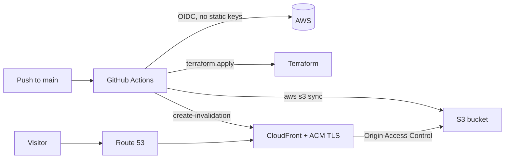

# AWS Static Website Hosting

Infrastructure-as-code for a personal static website, hosted on AWS and deployed automatically through a GitHub Actions CI/CD pipeline. Everything — the S3 buckets, CloudFront CDN, TLS certificate, DNS records, and deploy permissions — is defined in Terraform and provisioned reproducibly.

**Live site:** [brandonmoon.net](https://brandonmoon.net)

## Architecture



- **Amazon S3** stores the website files in a private bucket (no public access).
- **Amazon CloudFront** serves the content globally over HTTPS, reaching the bucket through **Origin Access Control (OAC)** so the bucket never has to be public.
- **AWS Certificate Manager (ACM)** issues a DNS-validated TLS certificate for the domain and its subdomains.
- **Amazon Route 53** maps `brandonmoon.net` and `www.brandonmoon.net` (IPv4 + IPv6) to the CloudFront distribution.
- **GitHub Actions** runs the pipeline and authenticates to AWS with **short-lived OIDC credentials** — there are no long-lived AWS access keys stored in the repo.
- **Terraform remote state** lives in a dedicated S3 bucket with a DynamoDB table for state locking.

## Repository layout

```
.
├── .github/workflows/deploy-website.yaml   # CI/CD pipeline
├── terraform/
│   ├── main.tf            # Root module wiring the modules together
│   ├── backend.tf         # S3 remote state + DynamoDB locking
│   ├── variables.tf       # Input variables
│   ├── outputs.tf         # Root outputs
│   ├── terraform.tfvars   # Values for this deployment
│   └── modules/
│       ├── remote_backend # State bucket + lock table
│       ├── github_oidc     # GitHub OIDC provider + scoped deploy role
│       ├── route53_acm     # Hosted zone lookup + ACM certificate
│       ├── s3_website       # Website content bucket
│       └── s3_cloudfront    # CloudFront distribution + DNS records
└── website/               # Static HTML/CSS content
```

## How deploys work

Every push to `main` triggers three sequential jobs:

1. **Deploy Infrastructure** — `terraform fmt -check`, `init`, `validate`, `plan`, then `apply`.
2. **Sync files to S3** — `aws s3 sync` uploads `website/` to the bucket (`--delete` removes stale files).
3. **Invalidate CloudFront** — clears the CDN cache so changes appear immediately.

All three jobs assume an IAM role via GitHub OIDC rather than using stored access keys.

## Security notes

- **No static AWS credentials.** CI authenticates through GitHub's OIDC provider and assumes a role whose trust policy is restricted to this repository's `main` branch.
- **Least-privilege deploy role.** The role's policy scopes S3 and DynamoDB access to the specific state/website/lock resources and limits IAM actions to managing only its own role and provider. CloudFront, ACM, and Route 53 are granted at the service level because they offer limited resource-level scoping — a production setup would tighten these further.
- **Private origin bucket.** Public access is fully blocked; only CloudFront can read objects, enforced via OAC and a bucket policy condition on the distribution ARN.

## Prerequisites

- An AWS account and a Route 53 hosted zone for the domain
- Terraform >= 1.5
- A registered domain managed in Route 53

## One-time setup

Because the Terraform state backend and the OIDC deploy role are themselves managed by this code, there is a small bootstrap step the first time:

1. **Bootstrap with admin credentials.** Using AWS credentials with sufficient permissions (e.g. an admin/SSO session — *not* a credential this stack is about to remove), run:

   ```bash
   cd terraform
   terraform init
   terraform apply
   ```

   This creates the state bucket, lock table, OIDC provider, and deploy role.

2. **Wire up GitHub.** Add these repository secrets in GitHub:
   - `AWS_ROLE_ARN` — the value of the `github_actions_role_arn` Terraform output
   - `DISTRIBUTION` — the value of the `cloudfront_distribution_id` output

3. **Push to `main`.** The pipeline now runs entirely with OIDC — you can delete any old `AWS_ACCESS_KEY_ID` / `AWS_SECRET_ACCESS_KEY` secrets.

## Configuration

Deployment values live in `terraform/terraform.tfvars` (domain, bucket names, GitHub org/repo, etc.). Update these to point the stack at your own domain and repository.
